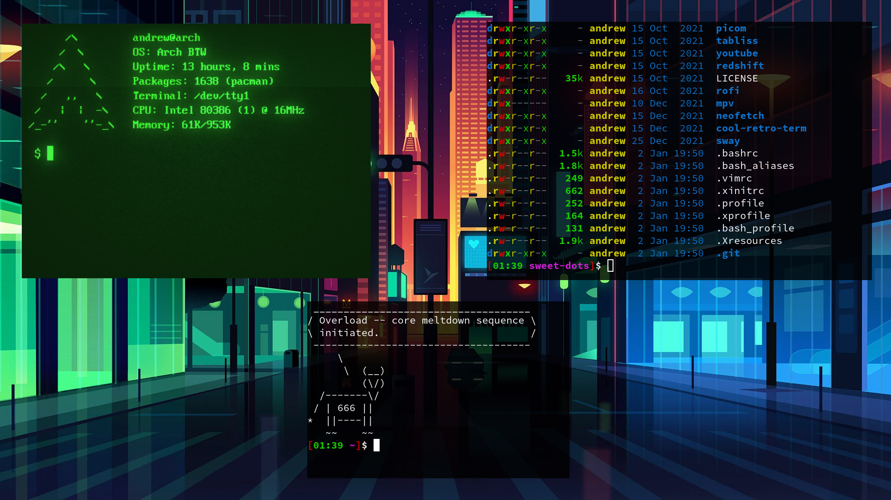

# sweet-dots

Dotfiles that make up a theme resembling the **Sweet KDE Theme**. The name of the theme is *Sweeter than 
Candy*, as my inspiration for this rice came from 2 years ago when I first started using desktop Linux and 
was drawn in by the fancy neon colors of the Sweet Theme.

    
      
    Qtile

    
      
    Sway

